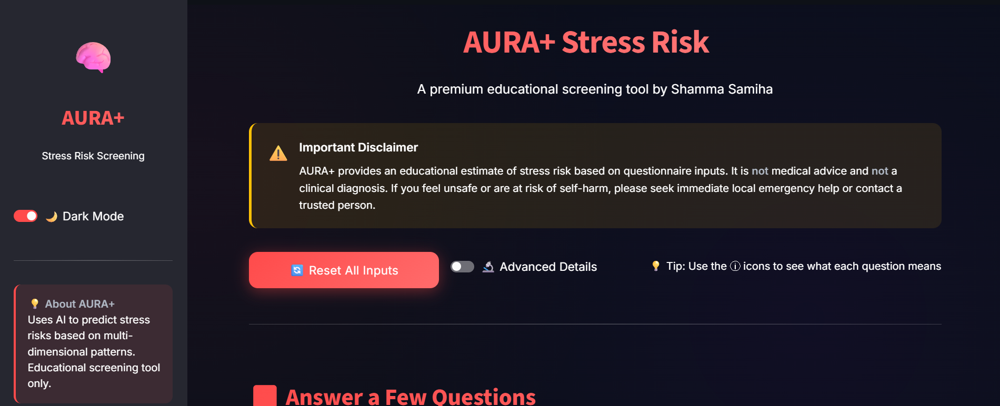
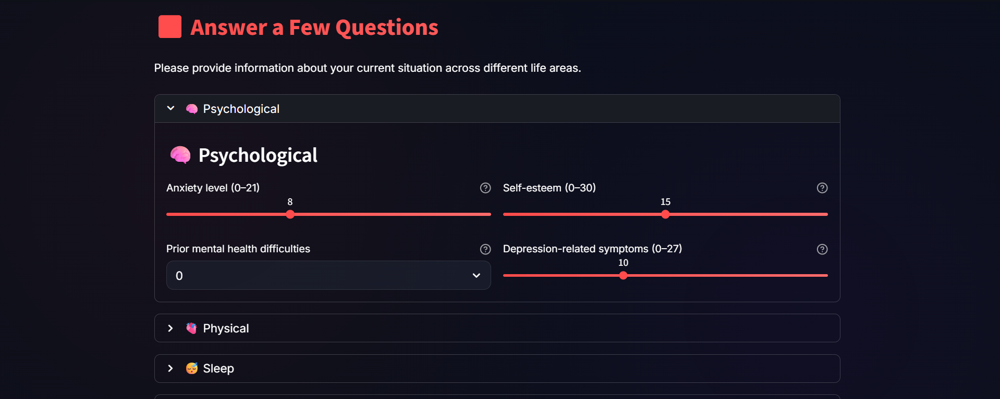
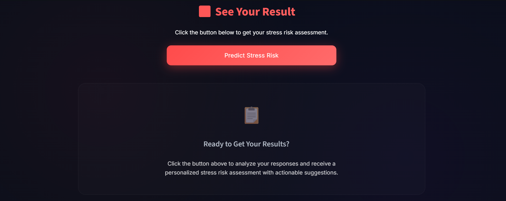
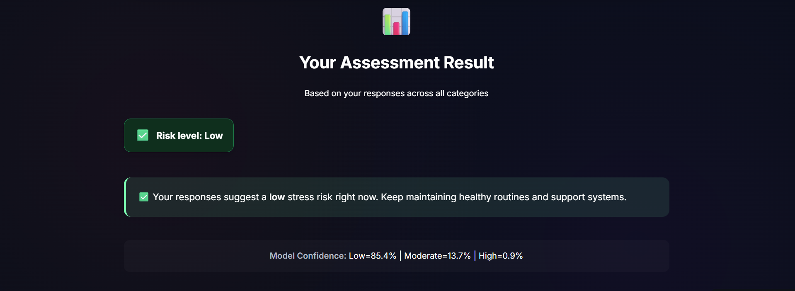
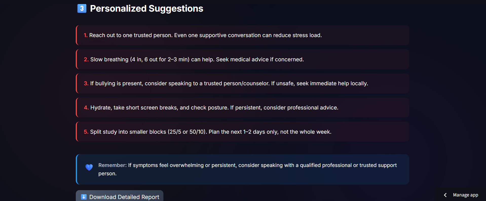

# AURA+ — Stress Risk Screening with Explainable AI

AURA+ is an interactive **machine learning–powered stress risk screening web application** that analyzes psychological, academic, physical, and social factors to estimate **stress risk levels** and provide **interpretable insights with actionable suggestions**.

> ⚠️ **Disclaimer**  
> AURA+ is an educational screening tool only. It does **not** provide medical advice, diagnosis, or treatment.  
> If you feel unsafe or at risk of self-harm, please seek immediate professional or local emergency support.

---

## ✨ Project Highlights

- End-to-end ML pipeline: **EDA → modeling → deployment**
- Explainable, interpretable predictions (not black-box)
- Modern Streamlit UI with dark/light mode
- Responsible AI framing for mental health applications
- Fully deployed and publicly accessible

---

## 🖥️ Application Preview

  

  

  

  

  

---

## 🧩 What the App Does

1. Collects user responses across **six life domains**:
   - Psychological
   - Physical
   - Sleep
   - Environment
   - Academic
   - Social
2. Predicts **stress risk level**:
   - Low
   - Moderate
   - High
3. Displays:
   - Prediction confidence (probabilities)
   - Key contributing features (explainability)
   - Personalized, non-clinical suggestions
4. Generates a downloadable **screening report**

---

## 📊 Dataset

- **Name:** Student Stress Factors: A Comprehensive Analysis  
- **Source:** Kaggle  
- **Link:** https://www.kaggle.com/datasets/rxnach/student-stress-factors-a-comprehensive-analysis  
- **Records:** ~1,100  
- **Features:** 20  
- **Target Variable:** `stress_level`  
  - `0` → Low  
  - `1` → Moderate  
  - `2` → High  

---

## 🔍 Exploratory Data Analysis — Key Insights

- Anxiety and depression show strong positive associations with stress
- Self-esteem and sleep quality decline as stress increases
- Study load, peer pressure, and career concerns are major contributors
- Social support acts as a protective factor
- Stress emerges as a multi-dimensional, cumulative phenomenon

---

## 🤖 Model Selection & Explainability

### Final Model
- **Logistic Regression**
- Accuracy: ~88%
- Balanced performance across all stress levels

### Why Logistic Regression?
- Strong baseline performance
- High interpretability
- Stable and suitable for sensitive domains like mental health

> A Random Forest model was evaluated but discarded due to increased
misclassification of low-stress cases and reduced transparency.

### Explainability
- Feature-level contribution analysis
- Directional impact (increases vs. reduces risk)
- Educational explanations — not deterministic claims

---

## 🛠️ Tech Stack

- Python
- pandas, NumPy
- scikit-learn
- matplotlib, seaborn
- Streamlit
- joblib

---

## 🗂️ Project Structure

AURA-plus/
├── asset/                 # App screenshots
├── data/
│   ├── raw/               # original dataset (ignored)
│   └── processed/         # cleaned dataset
├── notebooks/             # EDA & experiments
├── src/
│   ├── data/              # data loading & preprocessing
│   ├── features/          # feature engineering
│   ├── models/            # training scripts
│   └── app/               # Streamlit application
├── models/                # trained ML model
├── requirements.txt
├── runtime.txt
└── README.md

---

## 🚀 Deployment

- Hosted on **Streamlit Community Cloud**
- Cached model loading for performance
- Cloud-safe file handling
- Fully reproducible via GitHub

🔗 **Live App**  
https://aura-plus-stress-risk-prediction.streamlit.app/

---

## 🧠 Responsible AI Notes

- No personal data storage
- No clinical or medical claims
- Clear disclaimers and safety messaging
- Designed for awareness, reflection, and early screening

---

## 👩‍💻 Author

**Shamma Samiha**  
Data Science & Machine Learning Enthusiast

If you found this project useful, feel free to ⭐ the repository or connect.

---
