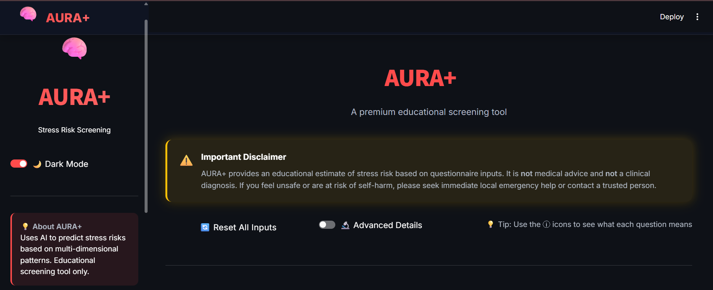
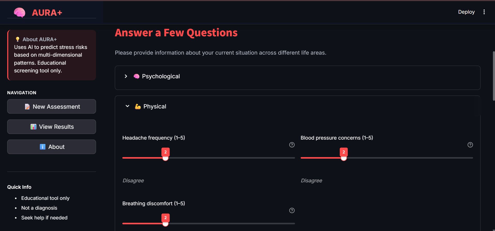
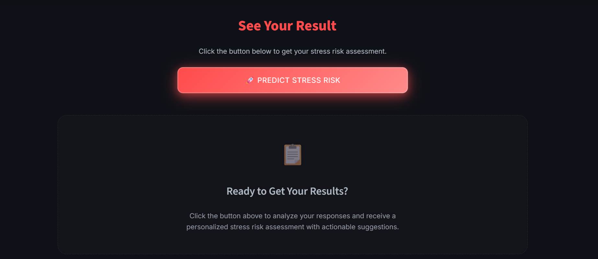
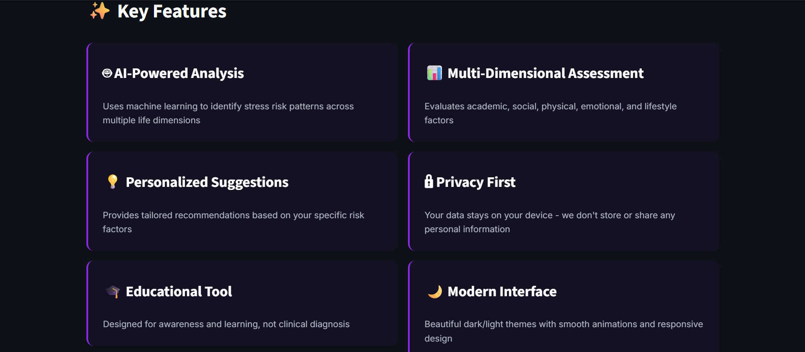
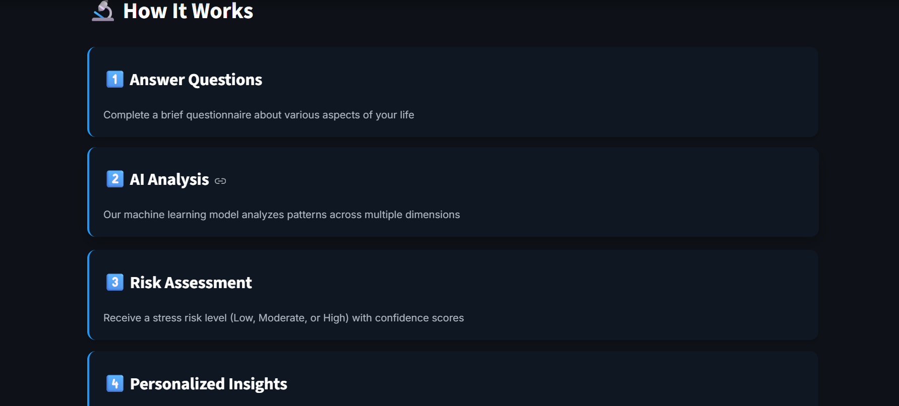
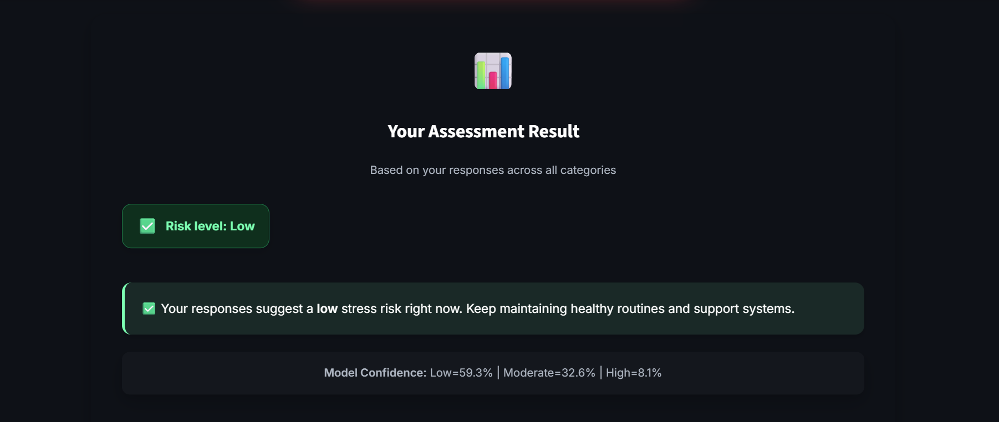
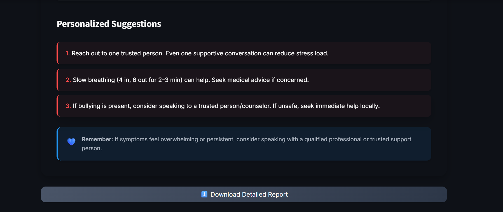

# 🌿 AURA+ — Stress Risk Screening with Explainable AI

AURA+ is a **production-ready, machine learning–powered stress risk screening web application** that analyzes psychological, physical, academic, social, and lifestyle factors to estimate **stress risk levels** and deliver **interpretable insights with actionable, non-clinical suggestions**.

The project demonstrates an **end-to-end data science workflow** — from exploratory data analysis and model development to deployment with a modern, user-centric interface.

---

## ⚠️ Disclaimer

> **Educational use only**  
> AURA+ does **not** provide medical advice, diagnosis, or treatment.  
> If you feel unsafe or at risk of self-harm, please seek immediate professional or local emergency support.

---

## ✨ Key Highlights

- ✅ End-to-end ML pipeline: **EDA → modeling → explainability → deployment**
- ✅ Explainable predictions (transparent, non–black-box model)
- ✅ Multi-dimensional stress assessment (6 life domains)
- ✅ Modern Streamlit UI with **dark/light mode**
- ✅ Cloud-safe deployment on **Streamlit Community Cloud**
- ✅ Responsible AI framing for mental health–related applications

---

## 🖥️ Live Demo

🔗 **Live Application**  
👉 https://aura-plus-stress-risk-prediction.streamlit.app/

---

## 📸 Application Preview

<p align="center">
  
</p>
<p align="center">
  
</p>
<p align="center">
  
</p>
<p align="center">
  
</p>
<p align="center">
  
</p>
<p align="center">
  
</p>
<p align="center">
  
</p>
<p align="center">
  
</p>

---

## 🧩 What AURA+ Does

1. Collects user responses across **six life domains**:
   - Psychological
   - Physical
   - Sleep
   - Environment
   - Academic
   - Social

2. Predicts **stress risk level**:
   - 🟢 Low
   - 🟡 Moderate
   - 🔴 High

3. Provides:
   - Prediction confidence (class probabilities)
   - Explainable feature contributions
   - Personalized, non-clinical suggestions
   - Downloadable screening report

---

## 📊 Dataset

- **Dataset Name:** Student Stress Factors: A Comprehensive Analysis  
- **Source:** Kaggle  
- **Link:** https://www.kaggle.com/datasets/rxnach/student-stress-factors-a-comprehensive-analysis  
- **Records:** ~1,100  
- **Features:** 20  
- **Target Variable:** `stress_level`  
  - `0` → Low  
  - `1` → Moderate  
  - `2` → High  

[](https://www.kaggle.com/datasets/rxnach/student-stress-factors-a-comprehensive-analysis)

---

## 🔍 Exploratory Data Analysis — Key Insights

- Anxiety and depression show strong positive correlation with stress level
- Self-esteem and sleep quality decline as stress increases
- Academic pressure, peer pressure, and career uncertainty are major contributors
- Social support acts as a protective factor
- Stress emerges as a **multi-dimensional, cumulative phenomenon**

---

## 🤖 Model Selection & Explainability

### ✅ Final Model
- **Logistic Regression**
- Accuracy: **~88%**
- Balanced performance across all stress levels

### Why Logistic Regression?
- High interpretability
- Stable performance
- Transparent decision boundaries
- Suitable for sensitive domains like mental health

> A Random Forest model was evaluated but discarded due to increased
misclassification of low-stress cases and reduced interpretability.

### Explainability Approach
- Feature-level contribution analysis
- Directional impact (risk-increasing vs risk-reducing factors)
- Educational explanations — **not deterministic claims**

---

## 🛠️ Tech Stack

- **Python**
- **pandas, NumPy**
- **scikit-learn**
- **matplotlib, seaborn**
- **Streamlit**
- **joblib**

---

## 🗂️ Project Structure

```text
AURA-plus/
├── asset/                 # App screenshots
├── data/
│   ├── raw/               # Original dataset (ignored)
│   └── processed/         # Cleaned dataset
├── notebooks/             # EDA & experimentation
├── src/
│   ├── data/              # Data loading & preprocessing
│   ├── features/          # Feature engineering
│   ├── models/            # Model training scripts
│   └── app/               # Streamlit application
│       ├── components/    # UI components
│       ├── static/        # CSS & assets
│       └── utils/         # Styling & helpers
├── models/                # Trained ML models
├── requirements.txt
├── runtime.txt
└── README.md


## 🚀 Deployment

- Hosted on **Streamlit Community Cloud**
- Cached model loading for performance
- Cloud-safe file handling
- Fully reproducible via GitHub

🔗 **Live App**  
https://aura-plus-stress-risk-prediction.streamlit.app/

---

## 🧠 Responsible AI Notes

- No personal data storage
- No clinical or medical claims
- Clear disclaimers and safety messaging
- Designed for awareness, reflection, and early screening

---

## 👩‍💻 Author

**Shamma Samiha**  
Data Science & Machine Learning Enthusiast

If you found this project useful, feel free to ⭐ the repository or connect.

---
